### `Olá, eu sou Anderson`

Tenho um grande interesse por tecnologia e sou um desenvolvedor de software, com experiência em Java, JS e React. Estou sempre buscando aprender mais sobre as últimas novidades e ferramentas, pois acredito que a educação contínua é a chave para o sucesso.
Estou pronto para contribuir em projetos divertidos e desafiadores com o meu entusiasmo por tecnologia e habilidades de programação.

```java
public class Anderson extends Dev {
  private final Map<String, Set<String>> mySkills = Map.of(
    "ProgramingLanguages", Set.of("Java", "Javascript"),
    "OtherLanguages", Set.of("HTML", "CSS", "Bash", "Json", "Markdown"),
    "Database", Set.of("MySQL", "MongoDB"),
    "Editors", Set.of("IntelliJ", "Vscode", "Sublime"),
    "Platforms", Set.of("GNU/Linux", "Windows"),
    "OtherTools", Set.of("Git")
  );
}

```

```mermaid
gantt
dateFormat  YYYY-MM-DD
title Experiência Profissional

section Carreira
Trybe                 :active,, 2021-08-01,2022-09-01
Mercado Livre         :active,, 2022-09-01,2023-05-30
```

<details>
<summary>Experiência Profissional</summary>
  


</details>

<details>
<summary>Formação Acadêmica</summary>

<p> 🎓 Análise e Desenvolvimento de Sistemas - Unijorge (2018 - 2021)</p>
<p> 🎓 Engenharia de Software - Anhanguera (em andamento)</p>

</details>

<details>
<summary>Github Stats</summary>

<p></p>
<p>&nbsp;</p>

</details>


> <i>“Seja curioso. Leia muito. Experimente coisas novas. Eu acho que muito do que as pessoas chamam de inteligência apenas se resume a curiosidade.”</i> - Aaron Swartz 
